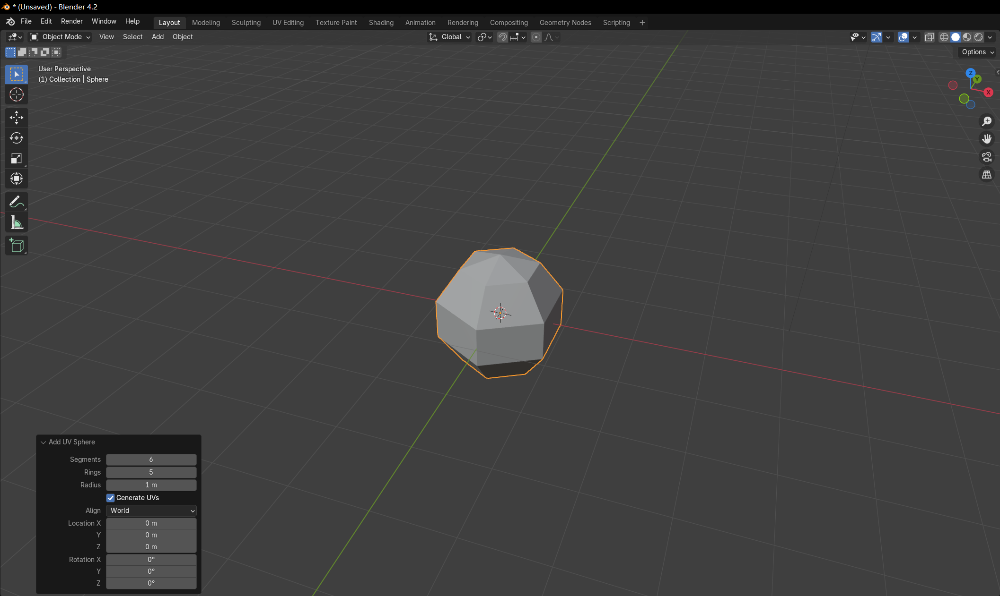
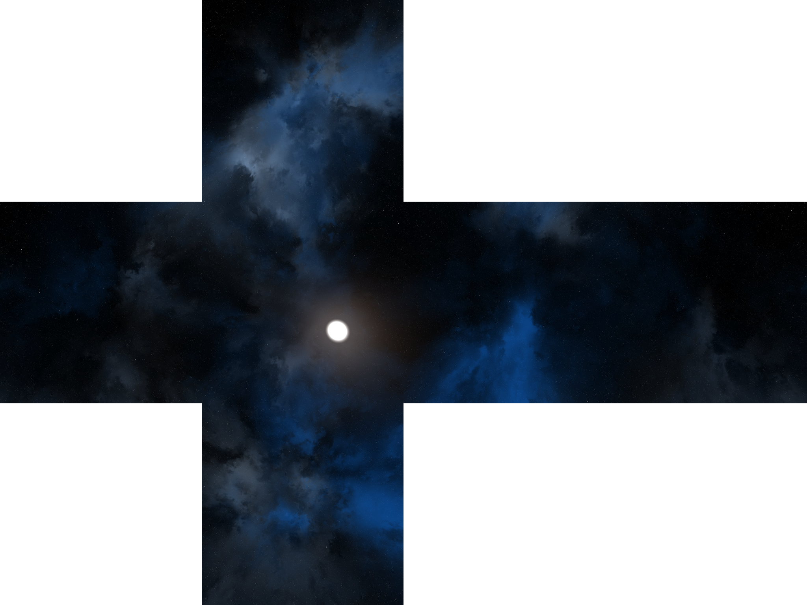
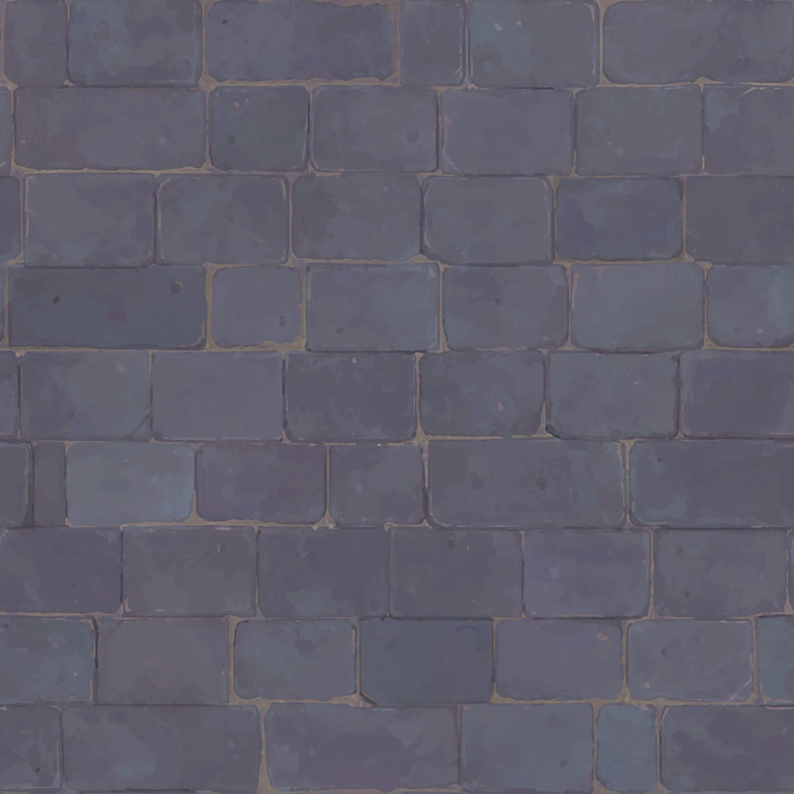
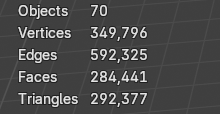
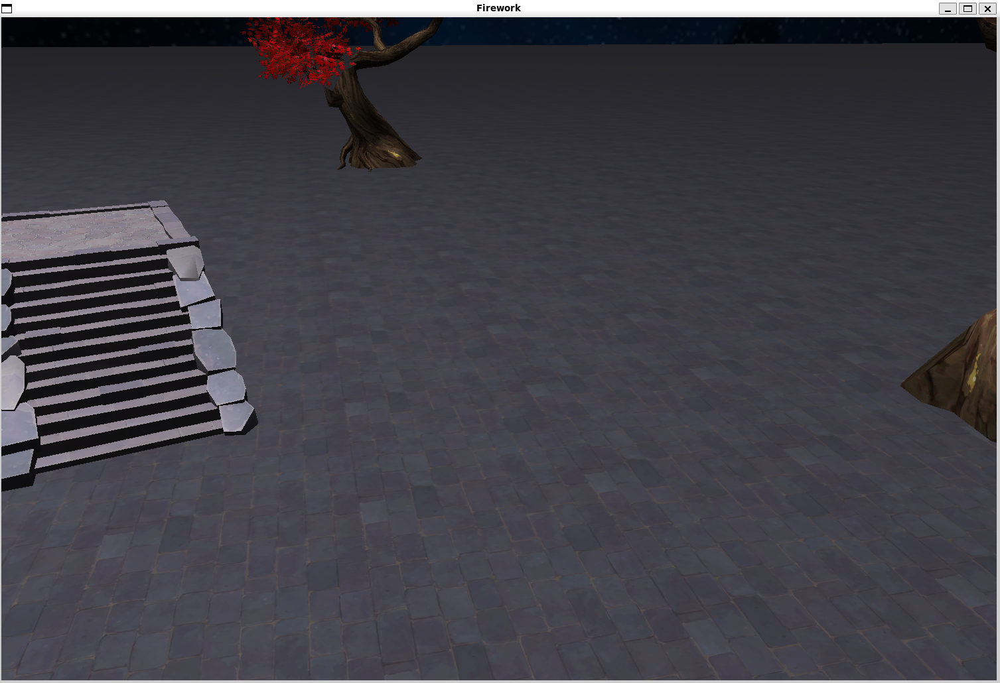
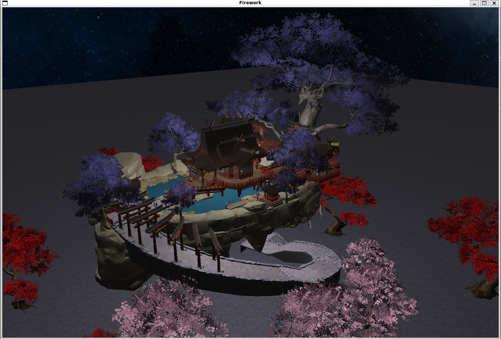

# 
计算机图形学期末大作业-小组报告

## 
题目：基于OpenGL的3D烟花粒子实时渲染系统

| 
姓名
 | 学号 | 分工 |
| ----------------------------------- | --- | --- |
|   莫子昊   | 22331067 | 确定选题与技术路线，构建渲染管线，实现粒子系统，添加烟花音效，场景素材搜集，场景搭建|
|   刘齐诚   | 22336152 | 重构项目代码，制定Code Review标准，贴图素材搜集| 
|   李世源   | 22342043 | 组织项目结构，场景素材搜集，场景导入与渲染，扩展烟花图案| 
|   许睿林   | 22331109 | 优化渲染性能，实现实时渲染| 

## 1. 实验概述

本实验在Linux / MacOS下实现了一个基于OpenGL的3D烟花粒子实时渲染系统，旨在通过计算机图形学技术模拟烟花爆炸的视觉效果，并结合音效、光照和场景渲染，提供一个沉浸式的烟花观赏体验。系统通过粒子系统模拟烟花的发射、爆炸和消散过程，并结合摄像机控制、光照模型和场景渲染技术，实现了逼真的3D烟花效果。

### 1.1 **系统架构**
系统主要由以下几个模块组成：

**摄像机模块**：负责摄像机的移动和视角控制，支持通过键盘输入进行前后左右移动以及视角的上下左右调整。
**粒子系统模块**：负责烟花的发射、爆炸和消散过程的模拟。每个烟花粒子具有位置、速度、加速度、颜色、透明度等属性，并根据物理规律进行更新。
**渲染模块**：负责将粒子、场景、天空盒等对象渲染到屏幕上。粒子渲染使用球体模型，并结合透明度衰减实现拖尾效果。
**场景模块**：包括天空盒、地面、神社模型等静态场景元素的加载和渲染，结合光照模型实现逼真的场景效果。
**音效模块**：通过SFML库实现烟花发射和爆炸时的音效播放。

### 1.2 **关键技术**
**粒子系统**：通过模拟烟花粒子的运动轨迹，实现烟花的发射、爆炸和消散效果。粒子在发射阶段沿抛物线上升，达到一定高度后爆炸，生成大量子粒子，子粒子在重力作用下逐渐消散。
**摄像机控制**：通过键盘输入控制摄像机的移动和视角调整，支持WASD键进行前后左右移动，方向键进行视角调整。
**光照模型**：使用点光源模拟烟花爆炸时的光照效果，并结合环境光源实现场景的整体照明。光源的强度和颜色随时间衰减，模拟烟花爆炸后的光晕效果。
**场景渲染**：使用立方体贴图实现天空盒渲染，结合地面和其他模型构建完整的3D场景。地面和其他模型通过纹理贴图和光照模型进行渲染，增强场景的真实感。

综合来说，本项目不仅成功构建了一套带有音效的三维烟花粒子模拟系统，还实现了基于Blinn-Phong光照模型的高精度场景实时渲染。

## 2. 技术路线与方案

### 2.0 写在前面

本项目没有沿用课内作业的Windows + Visual Studio + Qt + qmake的环境配置方案，而是采用Linux / MacOS + GLFW + CMake，原因如下：

- 1、Windows中C++环境配置困难，许多库需要自行下载后添加进环境变量，甚至有些需要自己手动编译，相比之下，Linux和MacOS可以在命令行中一键完成环境配置，极大地提高了项目的开发和复现效率。
- 2、Qt 适合开发复杂的桌面应用，但非常地庞大。而 GLFW 专注于提供窗口管理和 OpenGL 上下文创建，代码库小巧，性能开销小，非常适合实时渲染的任务，同时还支持 Windows、macOS 和 Linux。
- 3、CMake 是 C/C++ 生态中广泛使用的跨平台构建工具，避免了为每个平台单独维护构建脚本的麻烦。同时，CMake 提供了强大的依赖管理功能，可以通过 find_package 轻松集成第三方库，无需手动配置库路径。
  
### 2.1 粒子系统

#### 2.1.1 粒子系统设计目标
粒子系统的核心目标是模拟烟花的发射、爆炸和消散过程，通过控制粒子的位置、速度、加速度、颜色、透明度等属性，实现逼真的烟花效果。具体目标包括：

- **发射阶段**：模拟烟花从地面发射到空中的过程，粒子沿抛物线上升。
- **爆炸阶段**：烟花达到一定高度后爆炸，生成大量子粒子，子粒子向四周扩散。
- **消散阶段**：子粒子在重力作用下逐渐消散，透明度逐渐降低，最终消失。
- **拖尾效果**：在烟花发射和爆炸过程中，生成拖尾粒子，增强视觉效果。

#### 2.1.2 粒子属性设计

每个粒子通过Particle类进行管理，主要属性包括：

- 位置（vec3）
- 方向（vec3）
- 速度（vec3）
- 颜色（vec3）
- 加速度（vec3）
- 透明度（float）
- 生存时间（float）
- 是否已爆炸（bool）
- 是否可回收（bool）
- 是否为拖尾粒子（bool）

#### 2.1.3 粒子更新逻辑
粒子的更新逻辑通过update函数实现，主要包括以下几个步骤：

- **拖尾粒子生成**：如果当前粒子不是拖尾粒子，则在当前位置生成一个拖尾粒子，该拖尾粒子的位置与当前粒子相同，速度和加速度均设为(0.0, 0.0, 0.0)，同时可以通过设置transparency和ttl来控制视觉上的粒子拖尾长度。
- **速度与位置更新**：根据当前速度和加速度更新粒子的位置。加速度由空气阻力和重力共同决定，空气阻力依照公式F=kv来设计，k为空气阻力系数，v为当前速度，这意味着飞行速度越大的粒子所受的阻力越大，符合物理学规律，粒子的飞行轨迹也更贴近现实。
- **爆炸检测**：如果粒子未爆炸且速度的垂直分量小于阈值，则触发爆炸。爆炸时播放音效，生成爆炸光源，并根据爆炸图案生成大量子粒子。
- **透明度与生存时间更新**：根据粒子的状态更新透明度和生存时间。爆炸后的粒子透明度逐渐降低，生存时间逐渐减少。
- **拖尾粒子更新**：拖尾粒子的生存时间和透明度单独更新，透明度降低速度较快，控制拖尾长度在一个合适的范围内。
- **粒子回收**：粒子的回收通过check_recycle函数实现，当粒子的生存时间小于等于0、透明度小于等于0或标记为可回收时，粒子将被回收。回收的粒子从粒子列表中移除，避免不必要的计算和渲染。

#### 2.1.4 粒子系统集成
粒子系统通过Fireworks类进行集成，主要包括以下功能：

- 发射烟花：通过launch函数发射烟花，生成初始粒子并加入粒子列表。
- 更新粒子：通过update函数更新所有粒子的状态，生成新的粒子并回收旧的粒子。
- 渲染粒子：通过render函数渲染所有粒子，使用ParticleRenderer类进行渲染。

### 2.2 音效系统

#### 2.2.1 音效系统设计目标
音效系统的核心目标是为烟花发射和爆炸事件提供实时的音效反馈，增强用户的沉浸感。具体目标包括：

- 发射音效：在烟花发射时播放音效，模拟烟花升空的声音。
- 爆炸音效：在烟花爆炸时播放音效，模拟烟花爆炸的声音。
- 音效管理：支持多个音效的同时播放，避免音效冲突或中断。
- 性能优化：确保音效播放的高效性，避免对系统性能造成显著影响。

#### 2.2.2 音效系统架构
本项目的音效系统基于SFML（Simple and Fast Multimedia Library）实现，主要包括以下组件：

- 音效缓冲区（sf::SoundBuffer）：用于加载和存储音效文件的数据。
- 音效实例（sf::Sound）：用于播放音效，每个音效实例绑定一个音效缓冲区。
- 音效管理：通过数组管理多个音效实例，支持音效的循环播放和切换。

#### 2.2.3 音效管理
音效系统的初始化在程序启动时完成，主要包括以下步骤：

- 加载音效文件：通过sf::SoundBuffer::loadFromFile函数加载发射音效（launch.wav）和爆炸音效（explosion.wav）文件。
- 绑定音效实例：将加载的音效缓冲区绑定到sf::Sound实例中，每个音效实例对应一个音效缓冲区。
- 初始化音效索引：设置发射音效和爆炸音效的播放索引（launch_index和explosion_index），用于循环播放音效。

音效的播放逻辑通过processInput函数和Particle::update函数实现，主要包括以下步骤：

- 发射音效播放：当用户按下回车键发射烟花时，播放发射音效。通过launchSound[launch_index].play()函数播放当前索引的音效，并更新索引以循环使用音效实例。
- 爆炸音效播放：当烟花粒子爆炸时，播放爆炸音效。通过explosionSound[explosion_index].play()函数播放当前索引的音效，并更新索引以循环使用音效实例。
  
为了支持多个音效的同时播放，音效系统采用以下管理策略：

- 音效实例数组：使用sf::Sound数组管理多个音效实例，避免单个音效实例的重复播放导致音效中断。
- 音效索引循环：通过launch_index和explosion_index循环使用音效实例，确保每次播放都使用不同的音效实例，避免音效冲突。

#### 2.2.4 性能优化
为了确保音效系统的高效运行，采取了以下优化措施：

- 音效实例预加载：在程序启动时预加载所有音效实例，避免在运行时动态加载音效文件，减少延迟。
- 音效索引管理：通过循环使用音效实例，避免频繁创建和销毁音效实例，减少内存和CPU开销。

### 2.3 场景搭建与实时渲染

#### 2.3.1 场景模型处理与导入

- **烟花粒子模型**
  想要烟花粒子在屏幕上显示出来有几种方案，一个是OpenGL提供的点绘制，另一个是将每个粒子对应为一个实体小球然后将其渲染出来。为了更加真实地模拟粒子的效果，本项目采用blender导出的小球近似模型（共30个面，25个顶点）。小球的渲染不需要纹理，只需要直接给定烟花的颜色，所以实际上只采用了小球的.obj文件，未使用.mtl来采样纹理。
  

 图1.blender构建并导出小球近似模型

- **天空盒模型**
  天空盒是一个立方体，为了更方便地控制天空盒的大小，本项目直接在代码中定义天空盒各个顶点的坐标，并绑定从网上搜集的天空盒贴图素材，通过glDrawArrays绘制天空盒。

 图2.天空盒贴图

- **地面模型**
  与天空盒模型类似，在代码中定义地面模型的顶点坐标、纹理坐标和法线坐标，在定义纹理坐标时可以将其设置为超过[0, 1]范围的浮点数，这样有限大小的纹理会自动重复。

 图3.地面贴图

- **场景主体模型**
  本项目采用的场景主体是「原神」游戏中稻妻的鸣神大社，素材来源于网络（花了20块从某个网站上买的）。素材原格式为.blend，需要在blender中打开并导出为.obj和.mtl以及对应纹理图片才能用于本项目。在blender的统计信息中可以看到，该场景共有349,796个顶点，592,325条边，284,441个面。

 图4.场景主体宏观预览

 

 图5.场景主体微观预览

 

    

 图6.场景主体信息统计

#### 2.3.2 场景光源设置

#### 2.3.2.1 光源系统架构
光源系统基于Light结构体实现，主要包括以下属性：

- 位置（position）：光源在场景中的位置。
- 颜色（color）：光源的颜色，用于计算光照效果。
- 强度（intensity）：光源的强度，控制光照的亮度。
- 生存时间（ttl）：光源的生存时间，超过该时间后光源将被移除。

#### 2.3.2.2 静态环境光源
本项目的场景中共有两种环境光源，一种放置在场景主体上方距离较远处以模拟微弱的月光，另一种放置在场景主体各处的灯笼中，模拟灯笼发出的光线。这两种光源的位置与发光强度等信息在代码中固定设置，无需动态更新。

#### 2.3.2.3 动态粒子光源
在烟花爆炸时生成动态光源，光源的位置和颜色与爆炸粒子一致。光源的更新逻辑通过Fireworks::update函数实现，主要包括以下步骤：

- 光源强度衰减：根据时间衰减光源的强度，模拟光晕逐渐消失的效果。
- 光源生存时间更新：减少光源的生存时间，当生存时间小于等于0时，光源将被移除。
- 光源移除：通过std::remove_if函数移除生存时间结束或强度衰减为0的光源。

#### 2.3.3 实时渲染

本项目渲染管线的流程分为以下两个阶段：

##### 1.初始化阶段
- **窗口与上下文初始化**：通过GLFW创建窗口并初始化OpenGL上下文。
- **GLEW初始化**：加载OpenGL扩展函数，确保现代OpenGL功能可用。
- **深度测试启用**：启用深度测试（glEnable(GL_DEPTH_TEST)），确保物体正确遮挡
资源加载：加载模型、纹理、着色器等资源，初始化场景对象（如天空盒、地面、鸣神大社模型等）。

##### 2.主循环阶段

- **计算帧时间**：通过glfwGetTime获取当前时间，计算与上一帧的时间差，用于控制动画、物理模拟和摄像机移动的速度。
- **处理输入**：通过processInput函数处理用户输入（如摄像机移动、烟花发射），更新摄像机位置和视角。
- **清屏**：使用glClear清除颜色缓冲区和深度缓冲区，准备渲染新帧。
- **渲染固定背景**：天空盒、地面以及鸣神大社
- **更新粒子系统**：更新烟花粒子的状态（位置、速度、颜色等），生成新的粒子和光源，移除已失效的粒子和光源。
- **渲染粒子系统**：使用ParticleRenderer渲染所有烟花粒子，应用颜色和透明度效果。
- **交换缓冲区与事件处理**：使用glfwSwapBuffers交换前后缓冲区，将渲染结果显示到屏幕上，使用glfwPollEvents处理窗口事件（键盘、鼠标输入）。

##### 实现实时渲染的关键技术

- 1、**顶点数据传输**
    使用顶点缓冲对象（VBO），将顶点数据存储在GPU的显存中，避免每一帧都从CPU传输数据。具体来说，使用glGenBuffers生成VBO，接着使用glBindBuffer绑定VBO，最后使用glBufferData将顶点数据上传到GPU。
- 2、**纹理数据传输**
    使用stb_image库加载纹理文件，使用glGenTextures生成OpenGL纹理对象，在渲染时使用glBindTexture绑定纹理到着色器，最后使用glTexImage2D将纹理数据上传到GPU，支持漫反射、自发光和透明度贴图。此处最核心的优化是实现了**纹理批次渲染**，在初始化时根据材质对顶点数据进行分组，在渲染时按纹理批次绑定纹理并绘制。相比于没有实现纹理批次渲染，在渲染35w个顶点主体模型时的帧率在使用了纹理批次渲染后提升了10倍。
- 3、**光照数据传输**
    使用glUniform将光源数据传递到着色器，在着色器中根据光源数据计算光照效果。
- 4、**矩阵数据传输**
    包括模型矩阵、视图矩阵和投影矩阵。使用glUniformMatrix4fv将矩阵数据传递到着色器，在着色器中根据矩阵数据计算顶点的最终位置。
- 5、**粒子数据传输**
    包括位置、颜色、透明度等信息。使用glBufferData将粒子数据上传到GPU，在着色器中根据粒子数据计算渲染效果。

## 3. 实验效果

### 3.1 静态场景展示

在定义地面模型的顶点信息时，我们可以手动控制纹理的重复次数，本项目设置其为200，以使得每个石砖的大小看起来比较合适。

 图7.地面贴图展示

 

